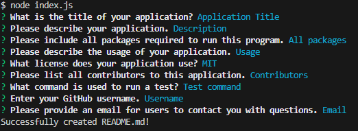

# README-Generator

## Description

This application allows users to quickly create a README file by using inquirer.
## Visuals

## Usage

The purpose of this application is to allow developers to quickly create README files without the hassle of having to apply proper markdown syntax.

## URL

https://steveb175.github.io/README-Generator/

## Credits

[Inquirer](https://www.npmjs.com/package/inquirer)

## License

MIT
